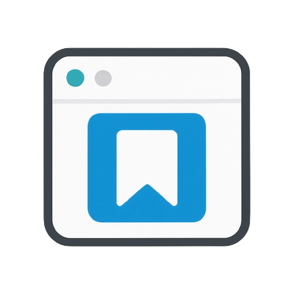

<div id="top">

<!-- HEADER STYLE: CLASSIC -->
<div align="center">



# TAB KEEPER

<em>Organize Your Tabs, Simplify Your Browsing Experience</em>

<!-- BADGES -->


<em>Built with the tools and technologies:</em>


</div>
<br>

---

## Table of Contents

- [Overview](#overview)
- [Getting Started](#getting-started)
    - [Prerequisites](#prerequisites)
    - [Installation](#installation)
    - [Usage](#usage)
    - [Testing](#testing)
- [Project Structure](#project-structure)
    - [Project Index](#project-index)
- [Contributing](#contributing)

---

## Overview

Organize your open tabs as clear tab sets! Save, group, and name tab collections with custom colors and icons. Switch between workspaces, open tabs with one click, and boost your productivity 

**Why TabKeeper?**

This project addresses the common pain points of tab clutter and disorganization. The core features include:

- 🎨 **Dynamic Tab Management:** Easily save, delete, and organize tabs to reduce clutter.
- 🔄 **One-Click Workspace Switching:** Switch between different tab sets with a single click. Perfect for separating work, study, and personal browsing sessions without losing your place.
- 🛠️ **Customizable Tab Sets:** Personalize your tab sets with colors and icons for better visual organization.
- 🖥️ **User-Friendly Interface:** Intuitive components enhance user interaction and overall experience.
- 💾 **Local Storage Integration:** Efficiently manage tab sets with persistent storage for easy access.

---

## Getting Started

### Prerequisites

This project requires the following dependencies:

- **Programming Language:** Vue.js
- **Package Manager:** Npm

### Installation

Build TabKeeper from the source and intsall dependencies:

1. **Clone the repository:**

    ```sh
    ❯ git clone https://github.com/soerenpriess/TabKeeper
    ```

2. **Navigate to the project directory:**

    ```sh
    ❯ cd TabKeeper
    ```

3. **Install the dependencies:**

	**Using [npm](https://www.npmjs.com/):**

	```sh
	❯ npm install
	```

4. **Build:**

	Build the project with:

	**Using [npm](https://www.npmjs.com/):**

	```sh
	npm run build
	```

5. **Load the Extension in Chrome:**
	1. Open Chrome and go to chrome://extensions/.

	2. Enable Developer mode (toggle in the top right).

	3. Click "Load unpacked".

	4. Select the dist folder generated by the build step.

	5. Your extension is now installed and ready to use!

6. **Development:**

	Develop the project with:

	**Using [npm](https://www.npmjs.com/):**

	```sh
	npm run build:watch
	```

	This command will continuously watch your source files and rebuild the extension automatically when changes are detected.

---

## Contributing

- **💬 [Join the Discussions](https://github.com/soerenpriess/TabKeeper/discussions)**: Share your insights, provide feedback, or ask questions.
- **🐛 [Report Issues](https://github.com/soerenpriess/TabKeeper/issues)**: Submit bugs found or log feature requests for the `TabKeeper` project.
- **💡 [Submit Pull Requests](https://github.com/soerenpriess/TabKeeper/blob/main/CONTRIBUTING.md)**: Review open PRs, and submit your own PRs.

<details closed>
<summary>Contributing Guidelines</summary>

1. **Fork the Repository**: Start by forking the project repository to your github account.
2. **Clone Locally**: Clone the forked repository to your local machine using a git client.
   ```sh
   git clone https://github.com/soerenpriess/TabKeeper
   ```
3. **Create a New Branch**: Always work on a new branch, giving it a descriptive name.
   ```sh
   git checkout -b new-feature-x
   ```
4. **Make Your Changes**: Develop and test your changes locally.
5. **Commit Your Changes**: Commit with a clear message describing your updates.
   ```sh
   git commit -m 'Implemented new feature x.'
   ```
6. **Push to github**: Push the changes to your forked repository.
   ```sh
   git push origin new-feature-x
   ```
7. **Submit a Pull Request**: Create a PR against the original project repository. Clearly describe the changes and their motivations.
8. **Review**: Once your PR is reviewed and approved, it will be merged into the main branch. Congratulations on your contribution!
</details>

<details closed>
<summary>Contributor Graph</summary>
<br>
<p align="left">
   <a href="https://github.com{/soerenpriess/TabKeeper/}graphs/contributors">
      
   </a>
</p>
</details>

---

## Project Structure

```sh
└── TabKeeper/
    ├── README.md
    ├── index.html
    ├── package-lock.json
    ├── package.json
    ├── public
    │   ├── logo.png
    │   └── manifest.json
    ├── src
    │   ├── App.vue
    │   ├── components
    │   ├── composables
    │   ├── main.js
    │   └── style.css
    └── vite.config.js
```

---

### Project Index

<details open>
	<summary><b><code>TABKEEPER/</code></b></summary>
	<!-- __root__ Submodule -->
	<details>
		<summary><b>__root__</b></summary>
		<blockquote>
			<div class='directory-path' style='padding: 8px 0; color: #666;'>
				<code><b>⦿ __root__</b></code>
			<table style='width: 100%; border-collapse: collapse;'>
			<thead>
				<tr style='background-color: #f8f9fa;'>
					<th style='width: 30%; text-align: left; padding: 8px;'>File Name</th>
					<th style='text-align: left; padding: 8px;'>Summary</th>
				</tr>
			</thead>
				<tr style='border-bottom: 1px solid #eee;'>
					<td style='padding: 8px;'><b><a href='https://github.com/soerenpriess/TabKeeper/blob/master/index.html'>index.html</a></b></td>
					<td style='padding: 8px;'>- Serves as the foundational entry point for the application, establishing the basic HTML structure necessary for rendering the user interface<br>- It integrates essential metadata and links to resources, while designating a specific element for the Vue application to mount<br>- This setup facilitates the seamless execution of the JavaScript logic defined in the main application file, ensuring a cohesive user experience.</td>
				</tr>
				<tr style='border-bottom: 1px solid #eee;'>
					<td style='padding: 8px;'><b><a href='https://github.com/soerenpriess/TabKeeper/blob/master/README.md'>README.md</a></b></td>
					<td style='padding: 8px;'>- Kickstart Vue 3 development with Vite using this template, designed to streamline the creation of applications leveraging Vue 3s single-file components<br>- It serves as a foundational setup, enabling developers to efficiently build and scale their projects while providing guidance on IDE support through the Vue documentation<br>- This template is essential for enhancing productivity and ensuring best practices in Vue 3 development.</td>
				</tr>
				<tr style='border-bottom: 1px solid #eee;'>
					<td style='padding: 8px;'><b><a href='https://github.com/soerenpriess/TabKeeper/blob/master/package.json'>package.json</a></b></td>
					<td style='padding: 8px;'>- Facilitates the management and configuration of the Tabkeeper project, a Vue.js application designed for efficient tab organization<br>- It defines essential scripts for development, building, and previewing the application, while also specifying dependencies for UI components and styling<br>- This structure supports a streamlined development workflow, ensuring a cohesive and responsive user experience.</td>
				</tr>
				<tr style='border-bottom: 1px solid #eee;'>
					<td style='padding: 8px;'><b><a href='https://github.com/soerenpriess/TabKeeper/blob/master/vite.config.js'>vite.config.js</a></b></td>
					<td style='padding: 8px;'>- Configures the Vite build tool for a Vue.js application, integrating essential plugins such as Tailwind CSS for styling and a hot reload extension for enhanced development experience<br>- Establishes a structured output for the build process, directing assets to a designated distribution folder while ensuring efficient management of entry and chunk files<br>- This setup streamlines development and deployment, enhancing overall project architecture.</td>
				</tr>
			</table>
		</blockquote>
	</details>
	<!-- src Submodule -->
	<details>
		<summary><b>src</b></summary>
		<blockquote>
			<div class='directory-path' style='padding: 8px 0; color: #666;'>
				<code><b>⦿ src</b></code>
			<table style='width: 100%; border-collapse: collapse;'>
			<thead>
				<tr style='background-color: #f8f9fa;'>
					<th style='width: 30%; text-align: left; padding: 8px;'>File Name</th>
					<th style='text-align: left; padding: 8px;'>Summary</th>
				</tr>
			</thead>
				<tr style='border-bottom: 1px solid #eee;'>
					<td style='padding: 8px;'><b><a href='https://github.com/soerenpriess/TabKeeper/blob/master/src/App.vue'>App.vue</a></b></td>
					<td style='padding: 8px;'>- Facilitates the user interface for the Tab Keeper application, enabling users to manage and organize their tab sets effectively<br>- It provides a dynamic tab navigation system, allowing users to switch between Home and Settings views<br>- Additionally, it incorporates functionalities for saving, deleting, and opening tab sets, along with a confirmation modal for deletion actions, enhancing user interaction and experience within the application.</td>
				</tr>
				<tr style='border-bottom: 1px solid #eee;'>
					<td style='padding: 8px;'><b><a href='https://github.com/soerenpriess/TabKeeper/blob/master/src/main.js'>main.js</a></b></td>
					<td style='padding: 8px;'>- Initializes the Vue application by importing essential components and styles, setting up Font Awesome icons for enhanced visual representation<br>- It establishes the main app structure and mounts it to the designated HTML element, ensuring a seamless user interface experience<br>- This foundational setup is crucial for the overall architecture, enabling further development and integration of features within the project.</td>
				</tr>
			</table>
			<!-- components Submodule -->
			<details>
				<summary><b>components</b></summary>
				<blockquote>
					<div class='directory-path' style='padding: 8px 0; color: #666;'>
						<code><b>⦿ src.components</b></code>
					<table style='width: 100%; border-collapse: collapse;'>
					<thead>
						<tr style='background-color: #f8f9fa;'>
							<th style='width: 30%; text-align: left; padding: 8px;'>File Name</th>
							<th style='text-align: left; padding: 8px;'>Summary</th>
						</tr>
					</thead>
						<tr style='border-bottom: 1px solid #eee;'>
							<td style='padding: 8px;'><b><a href='https://github.com/soerenpriess/TabKeeper/blob/master/src/components/TabItem.vue'>TabItem.vue</a></b></td>
							<td style='padding: 8px;'>- TabItem component enhances user interaction within the application by visually representing individual tabs<br>- It displays essential information such as the tabs title and URL, along with an optional favicon<br>- Users can easily open or delete tabs through intuitive buttons, promoting efficient tab management<br>- This component integrates seamlessly into the overall architecture, contributing to a cohesive and user-friendly interface.</td>
						</tr>
						<tr style='border-bottom: 1px solid #eee;'>
							<td style='padding: 8px;'><b><a href='https://github.com/soerenpriess/TabKeeper/blob/master/src/components/TabSetItem.vue'>TabSetItem.vue</a></b></td>
							<td style='padding: 8px;'>- TabSetItem.vue serves as a dynamic component for managing tab sets within the application<br>- It enables users to view, customize, and delete tab sets, while providing options to select colors and icons for each set<br>- The component enhances user interaction by allowing the expansion of tab details and facilitates the organization of tabs, contributing to a more intuitive and visually appealing user experience.</td>
						</tr>
						<tr style='border-bottom: 1px solid #eee;'>
							<td style='padding: 8px;'><b><a href='https://github.com/soerenpriess/TabKeeper/blob/master/src/components/TabSetList.vue'>TabSetList.vue</a></b></td>
							<td style='padding: 8px;'>- Facilitates the management of tab sets within the application by providing an interactive interface for users to add, expand, delete, and update tab sets<br>- It enhances user experience through a modal form for creating new tab sets and dynamically displays existing sets, allowing for seamless interaction and organization of tabs in a visually appealing manner.</td>
						</tr>
						<tr style='border-bottom: 1px solid #eee;'>
							<td style='padding: 8px;'><b><a href='https://github.com/soerenpriess/TabKeeper/blob/master/src/components/TabSelector.vue'>TabSelector.vue</a></b></td>
							<td style='padding: 8px;'>- TabSelector component facilitates the selection and management of browser tabs within the application<br>- It allows users to toggle individual tabs or select all tabs at once, enhancing user experience by providing a clear interface for managing multiple tabs<br>- The component dynamically displays the current tabs in the window, ensuring that users can easily interact with their browsing environment while maintaining a visually appealing layout.</td>
						</tr>
						<tr style='border-bottom: 1px solid #eee;'>
							<td style='padding: 8px;'><b><a href='https://github.com/soerenpriess/TabKeeper/blob/master/src/components/TextInput.vue'>TextInput.vue</a></b></td>
							<td style='padding: 8px;'>- TextInput component serves as a user-friendly input field within the application, allowing users to enter and edit text efficiently<br>- It features a label for clarity, handles user interactions such as saving and canceling input, and supports validation requirements<br>- By integrating seamlessly into the overall codebase architecture, it enhances the user experience and facilitates data binding through its reactive properties.</td>
						</tr>
						<tr style='border-bottom: 1px solid #eee;'>
							<td style='padding: 8px;'><b><a href='https://github.com/soerenpriess/TabKeeper/blob/master/src/components/Modal.vue'>Modal.vue</a></b></td>
							<td style='padding: 8px;'>- Modal component serves as a user interface element that presents critical information and prompts for user confirmation, such as deletion actions<br>- It enhances user experience by overlaying a semi-transparent background, focusing attention on the modal content<br>- With customizable titles and slots for additional content, it facilitates user interactions through clearly defined cancel and confirm buttons, ensuring intuitive decision-making within the application.</td>
						</tr>
						<tr style='border-bottom: 1px solid #eee;'>
							<td style='padding: 8px;'><b><a href='https://github.com/soerenpriess/TabKeeper/blob/master/src/components/TabSetForm.vue'>TabSetForm.vue</a></b></td>
							<td style='padding: 8px;'>- Facilitates the creation of a new tab set within the application, allowing users to customize their tab organization<br>- Users can select an icon, choose a color, and input a name for the tab set, while also viewing and selecting from currently open tabs<br>- The component enhances user experience by providing a visually appealing and interactive form for managing tab sets effectively.</td>
						</tr>
					</table>
				</blockquote>
			</details>
			<!-- composables Submodule -->
			<details>
				<summary><b>composables</b></summary>
				<blockquote>
					<div class='directory-path' style='padding: 8px 0; color: #666;'>
						<code><b>⦿ src.composables</b></code>
					<table style='width: 100%; border-collapse: collapse;'>
					<thead>
						<tr style='background-color: #f8f9fa;'>
							<th style='width: 30%; text-align: left; padding: 8px;'>File Name</th>
							<th style='text-align: left; padding: 8px;'>Summary</th>
						</tr>
					</thead>
						<tr style='border-bottom: 1px solid #eee;'>
							<td style='padding: 8px;'><b><a href='https://github.com/soerenpriess/TabKeeper/blob/master/src/composables/useTabSets.js'>useTabSets.js</a></b></td>
							<td style='padding: 8px;'>- Facilitates the management of tab sets within a Vue application by providing functionalities to load, save, and remove tab sets from local storage<br>- It ensures that tab data is normalized for consistency and allows users to easily organize their tabs, enhancing the overall user experience in the project’s architecture<br>- This composable serves as a central point for tab set operations, integrating seamlessly with the broader application.</td>
						</tr>
					</table>
				</blockquote>
			</details>
		</blockquote>
	</details>
</details>

---

<div align="left"><a href="#top">⬆ Return</a></div>

---
